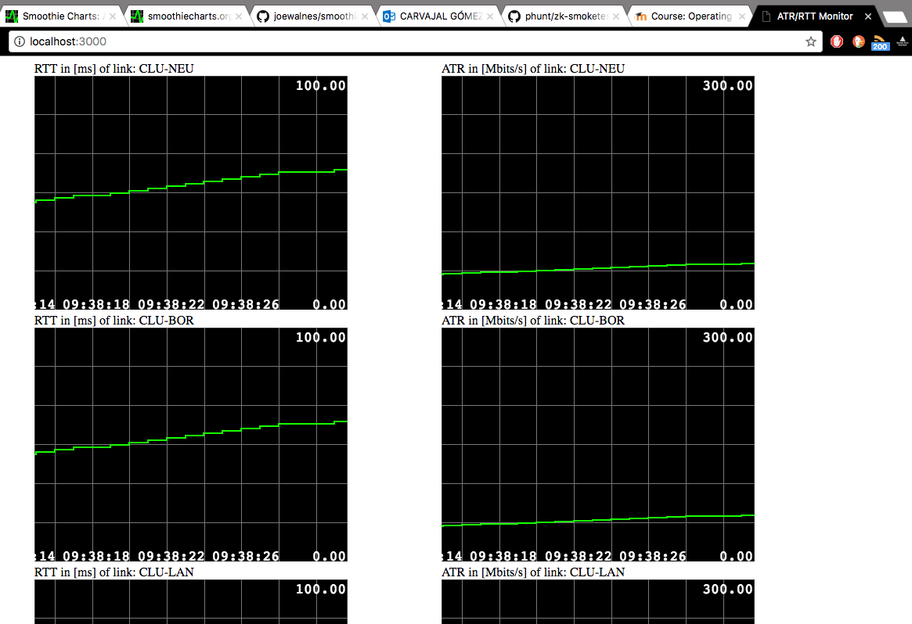

# georeplicated-sdn-iiun-tucn

##atr-owd-server

###Dependencies
- NodeJs
- NPM (NodeJs package manager)

###Installation
- `npm install`

###Run demo
Launching `do-rtt-streamer-test.sh` as follows:

- `./do-rtt-streamer-test.sh 60`

runs one web server to collect an stream of RTT/ATR measurements per 60 seconds. Open your browser and writing down `localhost:3000`, you will see the following output:

